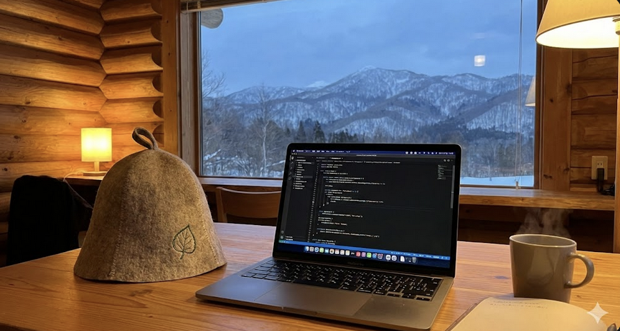

# 🚀 100 Days of Code 2026: The 100-App Challenge



> **"Your time is limited, so don't waste it living someone else's life." — Steve Jobs**

エンジニア 1 周年を迎え、2026 年のスタートダッシュとして**「100 日間で 100 個のアプリ/機能を作る」**という無謀で最高な挑戦を始めます。

## 🌲 About Me

- **Background:** 元・第 2 種電気主任技術者（7 年） → Web Application Engineer（2 年目）
- **Roots:** 北海道 帯広出身。大好きな故郷に戻りたくて、コードを書いています。
- **Passions:** サウナ ♨️ / AI 活用 🤖 / 哲学・自己啓発 📚 / ライフログの構築
- **Vision:** AI を活用したビジネスで独立し、「住む場所を自分で選べる」自由を手に入れること。

## 🔥 The Rules

1. **30 分 1 本勝負:** 毎日 30 分以内に一つの機能またはアプリを実装し、GitHub に Push する。
2. **AI-Driven Development:** Cursor / Antigravity をフル活用し、最速の開発プロセスを追求する。
3. **Keep it Real:** 綺麗なコードよりも「動くこと」、そして「泥臭い試行錯誤」を記録に残す。
4. **No Break:** 100 日間、例外なく「草」を植え続ける。

## 🛠 Tech Stack

- **Languages/Frameworks:** Next.js, TypeScript, Laravel, Rust, C++
- **Focus:** Web Architecture, Browser Internals, AI Integration, UI/UX for Life-logging

## 💻 How to Run

### Web Application (Next.js)

```bash
cd web
npm install
npm run dev
```

Access: http://localhost:3000

### Rust Application (Day 002)

```bash
cd rust/day002
cargo run
```

### Go Application (Day 003)

```bash
cd go/day003
go run .
```

- Quiz API

```bash
❯ curl -X POST -H "Content-Type: application/json" -d '{"id": "2", "answer": "Python"}' http://localhost:8080/quiz/check
```

### Java Application (Day 022)

```bash
❯ java BulkInsertSQLite
```
```bash
curl -o sqlite-jdbc-3.46.0.0.jar https://repo1.maven.org/maven2/org/xerial/sqlite-jdbc/3.46.0.0/sqlite-jdbc-3.46.0.0.jar && \
curl -o slf4j-api-2.0.16.jar https://repo1.maven.org/maven2/org/slf4j/slf4j-api/2.0.16/slf4j-api-2.0.16.jar && \
curl -o slf4j-simple-2.0.16.jar https://repo1.maven.org/maven2/org/slf4j/slf4j-simple/2.0.16/slf4j-simple-2.0.16.jar
```

## 📊 Challenge Log

| Day | Date  | Project / Feature    | Learning / Note                        | file                                                     |
| --- | ----- | -------------------- | -------------------------------------- | -------------------------------------------------------- |
| 001 | 01/01 | 100 日おみくじアプリ | チャレンジの旗揚げ。Next.js + Tailwind | [View](./hono-next/src/app/day001)                               |
| 002 | 01/02 | ライフゲーム         | Rust UI (eframe/egui)                  | [View](./rust/day002)                                    |
| 003 | 01/03 | Docker Quiz          | Go (net/http)                          | [View](./hono-next/src/app/day003) [View](./go/day003/) |
| 004 | 01/04 | CLI Pomodoro Timer   | Rust (indicatif)                       | [View](./rust/day004)                                    |
| 005 | 01/05 | 簡易習慣記録 App     | Data Persistence (serde/json)          | [View](./rust/day005)                                    |
| 006 | 01/06 | Rails Keep App       | Rails 8 / Turbo / Tailwind             | [View](./rails/day006)                                   |
| 007 | 01/07 | Pacman Game          | Java Swing                             | [View](./java/day007)                                    |
| 008 | 01/08 | Calendar App         | React / Material UI                    | [View](./react/day008)                                   |
| 009 | 01/09 | Digital Clock        | React / Vite                           | [View](./react/day009)                                   |
| 010 | 01/10 | Stopwatch            | React / Vite                           | [View](./react/day010)                                   |
| 011 | 01/11 | Zundamon Chat App    | Next.js / Gemini API / VOICEVOX        | [View](./react/day011-zundamon-chat)                     |
| 012 | 01/12 | Notion BI App        | Notion API / MUI                       | [View](./hono-next/src/app/day012)                               |
| 013 | 01/13 | Zen Breathing App    | Next.js / Tailwind / Vanilla JS        | [View](./day013-zen-breathing)                               |
| 014 | 01/14 | Password Manager     | React Query / TanStack Query           | [View](./react/day014)                                   |
| 015 | 01/15 | Collaborative Canvas | Go (WebSocket) / React (Canvas)        | [View](./react/day015)                                   |
| 016 | 01/16 | Kanban Board         | React / Vite / dnd-kit                 | [View](./react/day016-kanban-board)                      |
| 017 | 01/17 | Tetris               | React / Vite / TypeScript    | [View](./react/day017)                            |
| 018 | 01/18 | JSON LOG            | HTML / Vanilla JS                      | [View](./html/day018)                                    |
| 019 | 01/19 | MD to JSON Converter | HTML / Vanilla JS / CSS                | [View](./html/day019)                                    |
| 020 | 01/20 | Pic-Spot             | Image Drop & Gallery (Dexie / Canvas) | [View](./hono-next/src/app/day020)                      |
| 021 | 01/21 | MindFlow             | 感情ログ & 一言日記 (Framer Motion)   | [View](./hono-next/src/app/day021)                      |
| 022 | 01/23 | Bulk Insert SQLite   | Java JDBC / 1M records in 1.6s         | [View](./java/day022)                                    |
| 023 | 01/23 | SQL Drill            | Browser-side SQLite (sql.js) / PWA    | [View](./hono-next/src/app/day023)                      |
| 024 | 01/24 | Gomoku Game          | React / Game Logic / CSS Grid          | [View](./react/day024)                                   |
| 025 | 01/25 | Dockerfile Typing    | HTML / Tailwind (CDN) / Vanilla JS     | [View](./html/day025)                                    |
| 026 | 01/26 | Commit Log App       | File System Access API / HTML          | [View](./html/day026)                                    |
| 027 | 01/27 | TUI Pomodoro Timer   | Go (bubbletea) / TUI                   | [View](./go/day027-pomodoro-timer)                       |
| 028 | 01/28 | Glassmorphism Gen    | React / Tailwind / Clipboard API       | [View](./hono-next/src/app/day028)                               |
| 029 | 01/29 | YouTube Timestamp    | Chrome Extension (Manifest V3) / JS    | [View](./html/day029-chrome-yt)                          |
| 030 | 01/30 | Gravity Dash         | React (Canvas API) / Game Loop         | [View](./hono-next/src/app/day030)                               |
| 031 | 01/31 | YT_LOG.exe           | React / YouTube IFrame API / LocalStorage | [View](./hono-next/src/app/day031)                               |
| 032 | 02/01 | Text Stats App       | React / useMemo / リアルタイム計算     | [View](./hono-next/src/app/day032)                               |
| 033 | 02/02 | Debugging Tavern     | RPG風クイズ / Framer Motion / Game Dev | [View](./hono-next/src/app/day033)                               |
| 034 | 02/03 | MyBatis Tutor        | React / e-learning UI / LocalStorage   | [View](./hono-next/src/app/day034)                               |
| 035 | 02/04 | Quick Markdown       | React / Live Preview / Auto-save       | [View](./hono-next/src/app/day035)                               |
| 036 | 02/05 | Lyric Studio         | React / iTunes API / YouTube Music Link| [View](./hono-next/src/app/day036)                               |
| 037 | 02/06 | Simple Tango         | React / Flashcard UI / LocalStorage    | [View](./hono-next/src/app/day037)                               |
| 038 | 02/07 | Pic-Spot v2          | HTML / Dexie.js / Categories           | [View](./html/day038-fork-020)                           |
| 039 | 02/08 | Reflection Log       | React / PWA / Firebase Hosting / 5行日記 | [View](./hono-next/src/app/day039)                               |
| 040 | 02/09 | Real-time Board      | Next.js / Pusher / Canvas API          | [View](./hono-next/src/app/day040)                               |
| 041 | 02/10 | AI Tech Pulse        | Gemini API / GitHub Actions / RSS      | [View](./hono-next/src/app/day041)                                    |
| 042 | 02/11 | Grass Designer       | Next.js / Tailwind / Grid Operation    | [View](./hono-next/src/app/day042)                                |
| 043 | 02/12 | Reflection Log v2    | Supabase / Google Auth / PWA           | [View](./docs/log)                                       |
| 044 | 02/13 | GCP Docker Architect | Dockerfile Gen / Cloud Run             | [View](./hono-next/src/app/day044)                                |
| 045 | 02/14 | Anonymous Board      | Cloudflare D1 / Next.js / Server Actions | [View](./hono-next/src/app/day045)                  |
| 046 | 02/15 | Drizzle CRUD Typist  | Drizzle ORM / Typing Game UI           | [View](./hono-app/src/app/day046)                        |
| 047 | 02/16 | Chat Room            | WS / Hono / Durable Objects / Next.js  | [View](./hono-app/src/app/day047)                        |
| 048 | 02/17 | VPN Defender         | "Fragile by Design" Game / Canvas      | [View](./hono-app/src/app/day048)                        |
| 049 | 02/18 | Universal Draft App  | React / Custom Limits / LocalStorage   | [View](./hono-app/src/app/day049)                        |
| 050 | 02/19 | 100 Days Roadmap     | Tech Stack Visualization / Dashboard   | [View](./hono-next/src/app/roadmap) [View](./hono-next/src/app/dashboard) |
| 051 | 02/20 | GoF Design Patterns  | React / Interactive Learning / UI / UX | [View](./hono-app/src/app/day051)                        |
| 052 | 02/21 | Clipboard Manager      | アカウント連携 / 定型文1タップ全コピ   | [View](./hono-app/src/app/day052)                        |
| 053 | 02/22 | Smart Tango            | AI Flashcard / Cron / Requesty / Hono    | [View](./hono-app/src/app/day053/dashboard)                 |
| 054 | 02/23 | SQL Index Simulator    | 1M Rows Browser DB / sql.js Speed Test | [View](./hono-app/src/app/day054)                           |
| 055 | 02/24 | JWT Decoder Playground | Hono JWT / Server Actions / Base64     | [View](./hono-app/src/app/day055)                           |
| 056 | 02/25 | ずんだもんNEWS       | VOICEVOX / はてブ音声ニュース           | [View](./hono-app/src/app/day056)                           |
| 057 | 02/26 | Draw App             | Canvas / レイヤー / shadcn/ui          | [View](./hono-app/src/app/day057)                           |
| 058 | 02/27 | AI Canvas App        | Antigravity / Gemini API / Hono API      | [View](./hono-app/src/app/day058)                           |
| 059 | 02/28 | OAuth Troubleshooting| Session Bridge / CORS / better-auth      | [View](./hono-next/src/app/day059)                      |
| 060 | 03/01 | Mini X Clone         | R2 Object Storage / Videos / Hono API    | [View](./hono-next/src/app/day060)                      |
| 061 | 03/02 | VS Code Shortcuts    | VS Code Commands / Cheat Sheet           | [View](./hono-next/src/app/day061)                      |
| 062 | 03/03 | Animated Cash Book   | JSON to Excel / Animation / xlsx         | [View](./hono-next/src/app/day062)                      |
| 063 | 03/04 | Accounting App       | Strategy Pattern / CSV, XML, MD Report   | [View](./hono-next/src/app/day063)                      |
| 064 | 03/05 | NDL OCR API          | Python (FastAPI) / ndlocr-lite / Cloud Run | [View](./hono-next/src/app/day064)                      |
| 065 | 03/06 | LFM 2.5 Chat         | Local AI Chat / Ollama / React Markdown    | [View](./hono-next/src/app/day065)                      |
| 066 | 03/07 | NDL OCR Parser       | NDL OCR API / React / AI                   | [View](./hono-next/src/app/day066)                      |
| 067 | 03/08 | Rails VPS Deploy     | Rails 8 / Kamal / Hetzner VPS              | [View](./rails/vps)                                      |
| 068 | 03/09 | Rails VPS Reverse Proxy| Hono API + Rails / Kamal / Hetzner VPS   | [View](./rails/vps)                                      |

## 📬 Links
- **day042 log** https://ruu2023.github.io/100-days-of-code-2026/log/
- **day041 ai news** https://ruu2023.github.io/100-days-of-code-2026/

- **Blog:** [ruucode.com](https://ruucode.com/)
- **X (Twitter):** [@ruu_web](https://x.com/ruu_web)
- **YouTube:** [original-app-tutorial](https://www.youtube.com/@original-app-tutorial)

---

_Created by ruu - 2026 年、最高に正直に、ストイックに走り抜けます。_
